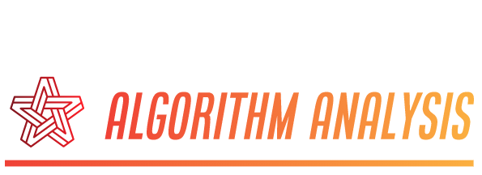

# Algorithm-Analysis

    
     Analysis of various sorting algorithms. 

## Contributing 

To contribute to Algorithm-Analysis, fork the repository, create a new branch and send us a pull request. Make sure you read [CONTRIBUTING.md](https://github.com/SVijayB/Algorithm-Analysis/blob/master/.github/CONTRIBUTING.md) before sending us Pull requests. 

Also, thanks for contributing to Open-source!

## License 

Algorithm-Analysis is under The MIT License. Read the [LICENSE](https://github.com/SVijayB/Algorithm-Analysis/blob/master/LICENSE) file for more information.